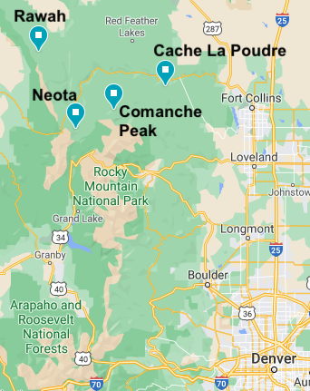
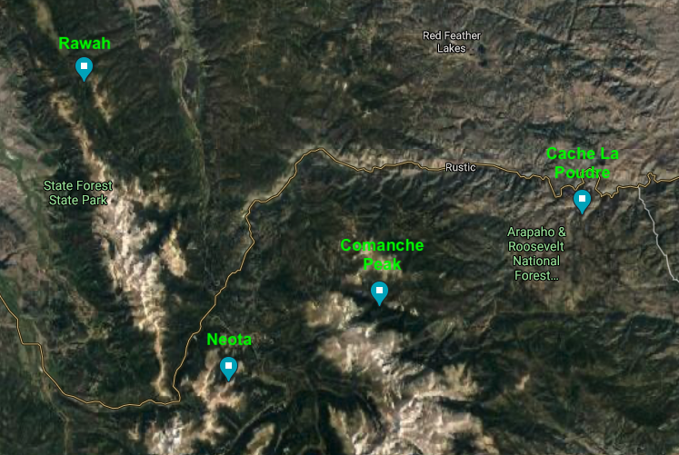

# An overview of the 4 wilderness areas







# EDA


```{r, include=FALSE}
library(tidyverse)
library(patchwork)
library(Hmisc) # for describe function

forest <- read.csv('forest-cover-type-prediction/train.csv')

forest <- forest %>%  mutate(Cover = as.factor(Cover_Type))

describe(forest)
```


From the describe function (output hidden) we see that:

- there are no missing values
- there do not appear to be any duplicates
- the data is evenly distributed between each Cover Type: $2,160$ rows each
- the distribution is skewed across Wilderness Area:

  1 - Rawah Wilderness Area: 3597
  
  2 - Neota Wilderness Area: 499
  
  3 - Comanche Peak Wilderness Area: 6349
  
  4 - Cache la Poudre Wilderness Area: 4675


## Variable plots


```{r}
forest %>% 
  mutate(Cover = as.factor(Cover_Type)) %>%
  ggplot(aes(x=Cover, y=Elevation)) +
  geom_boxplot(aes(fill=Cover, group=Cover)) +
  ggtitle('Fig 1:  Elevation')
```


```{r}
forest %>% 
  mutate(Cover = as.factor(Cover_Type)) %>%
  ggplot(aes(x=Cover, y=Slope)) +
  geom_boxplot(aes(fill=Cover, group=Cover)) +
  ggtitle('Fig 2:  Slope')
```


```{r}
forest %>% 
  mutate(Cover = as.factor(Cover_Type)) %>%
  ggplot(aes(x=Cover, y=Aspect)) +
  geom_boxplot(aes(fill=Cover, group=Cover)) +
  #geom_jitter(alpha=0.2, width=0.1, height=0.0) +
  ggtitle('Fig 3:  Aspect seems like a poor predictor')
```


```{r}
forest %>% 
  mutate(Cover = as.factor(Cover_Type)) %>%
  ggplot(aes(x=Cover, y=Horizontal_Distance_To_Hydrology)) +
  geom_boxplot(aes(fill=Cover, group=Cover)) +
  ggtitle('Fig 4:  Horiz Dist to Hydro')
```


```{r}
forest %>% 
  mutate(Cover = as.factor(Cover_Type)) %>%
  ggplot(aes(x=Cover, y=Vertical_Distance_To_Hydrology)) +
  geom_boxplot(aes(fill=Cover, group=Cover)) +
  ggtitle('Fig 5:  Vertical Distance to Hydro seems
          like a poor predictor')
```


```{r}
forest %>% 
  mutate(Cover = as.factor(Cover_Type)) %>%
  ggplot(aes(x=Cover, y=Horizontal_Distance_To_Fire_Points)) +
  geom_boxplot(aes(fill=Cover, group=Cover)) +
  ggtitle('Fig x:  Horiz Distance to Fire')
```


```{r}
forest %>% 
  mutate(Cover = as.factor(Cover_Type)) %>%
  ggplot(aes(x=Slope, y=Elevation)) +
  geom_point(alpha=.1)+
  facet_grid(.~forest$Cover) +
  ggtitle('Fig 6:  Elevation vs Slope per Cover category')
```

```{r}
forest %>% 
  mutate(Cover = as.factor(Cover_Type)) %>%
  ggplot(aes(x=Slope, y=Aspect)) +
  geom_boxplot(alpha=.1)+
  facet_grid(forest$all_wilderness_area~forest$Cover) +
  ggtitle('Fig 7:  Aspect vs Slope per Cover category')
```


```{r}
forest <- forest %>% 
  mutate(all_wild = Wilderness_Area1+Wilderness_Area2+Wilderness_Area3+Wilderness_Area4)
summary(forest$all_wild)
```

Based on this we can see that each tree is assigned to one and only one Wilderness_Area.

Converting Wilderness_Area to a single column:

```{r}
factors = c(12:15)
wilderness_area = rep(0, length(forest))
for(f in factors){
    colvalues=forest[,f]
    wilderness_area[which(colvalues==1)] = f-11
}
forest$all_wilderness_area <- wilderness_area
summary(forest$all_wilderness_area)
```

```{r}
forest %>% 
  mutate(Cover = as.factor(Cover_Type)) %>%
  ggplot(aes(x=Cover, y=all_wilderness_area)) +
  geom_jitter(alpha=0.1) +
  ggtitle('Fig x:  Wilderness Area seems to be a predictor of Cover')+
  ylab('Wilderness Area')
```


```{r}
factors = c(16:55)
soil_type = rep(0, length(forest))
for(f in factors){
    colvalues=forest[,f]
    soil_type[which(colvalues==1)]=soil_type[which(colvalues==1)]+1
}
forest$all_soil_type <- soil_type
max(forest$all_soil_type)
summary(soil_type)
```

Based on this we can see that each tree is assigned to one and only one Soil_Type.


Converting Soil_Type to a factor:

```{r}
factors = c(16:55)
soil_type = rep(0, length(forest))
for(f in factors){
    colvalues=forest[,f]
    soil_type[which(colvalues==1)] = f-15
}
forest$all_soil_type <- soil_type
summary(forest$all_soil_type)
```


```{r}
forest %>% 
  mutate(Cover = as.factor(Cover_Type)) %>%
  ggplot(aes(x=Cover, y=all_soil_type)) +
  geom_jitter(alpha=.1)+
  ggtitle('Fig x:  Soil Type seems to be a predictor of Cover')
```


```{r}
forest %>% 
  ggplot(aes(x=all_soil_type, y=all_wilderness_area)) +
  geom_jitter(alpha=.1) +
  facet_grid(.~forest$Cover) +
  ggtitle('Fig x:  Soil Type seems to be a predictor of Cover')
```


```{r}
forest %>% 
  ggplot(aes(y=Elevation, x=all_soil_type)) +
  geom_jitter(alpha=.1) +
  facet_grid(.~forest$Cover) +
  ggtitle('Fig x:  ')
```


```{r}

forest %>% 
  mutate(shade = (Hillshade_9am + Hillshade_Noon + Hillshade_3pm)) %>%
  ggplot(aes(y=Elevation, x=shade)) +
  geom_jitter(alpha=.1) +
  facet_grid(.~forest$Cover) +
  ggtitle('Fig x:  ')
```


```{r}
forest %>% 
  mutate(line_hydro = sqrt(Horizontal_Distance_To_Hydrology**2 + Horizontal_Distance_To_Hydrology**2)) %>%
  ggplot(aes(y=Elevation, x=line_hydro)) +
  geom_jitter(alpha=.1) +
  facet_grid(.~forest$Cover) +
  ggtitle('Fig x:  ')
```


```{r}
forest %>% 
  ggplot(aes(y=Slope, x=Aspect)) +
  geom_jitter(alpha=.1) +
  facet_grid(.~forest$Cover) +
  ggtitle('Fig x:  ')
```


```{r}
forest %>% 
  ggplot(aes(y=Elevation, x=Aspect, color=as.factor(wilderness_area))) +
  geom_jitter(alpha=.1) +
  facet_grid(.~forest$Cover) +
  ggtitle('Fig x:  ')
```


```{r}
forest %>% 
  ggplot(aes(y=soil_type, x=1, color=as.factor(all_wilderness_area))) +
  geom_jitter(alpha=.1) +
  facet_grid(~forest$Cover) +
  ggtitle('Fig x:  ')
```


```{r}
forest %>% 
  ggplot(aes(x=all_wilderness_area, y=Elevation, color=Cover)) +
  geom_jitter(alpha=.25) +
#  facet_grid(.~forest$Cover) +
  ggtitle('Fig x:  High overlap of different cover types 
          in each area across elevations')
```


```{r}
forest %>% 
  mutate(shade = Hillshade_9am + Hillshade_Noon + Hillshade_3pm) %>%
  ggplot(aes(x=Cover, y=shade, fill=Cover)) +
  geom_boxplot() +
#  facet_grid(.~forest$all_wilderness_area) +
  ggtitle('Fig x:  Total shade during day')
```


# Modeling

```{r}
library(nnet)
forest_tmp <- forest %>%
  mutate(wildarea = as.factor(all_wilderness_area)) %>%
  mutate(soiltype = as.factor(all_soil_type))

mod <- multinom(data=forest_tmp, Cover ~ Elevation + wildarea)# adding this breaks it + soiltype)
summary(mod)
```
