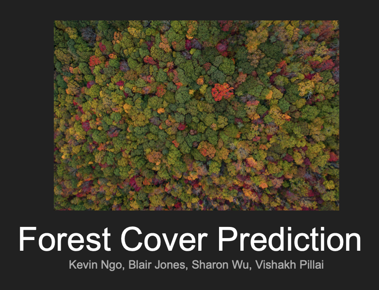
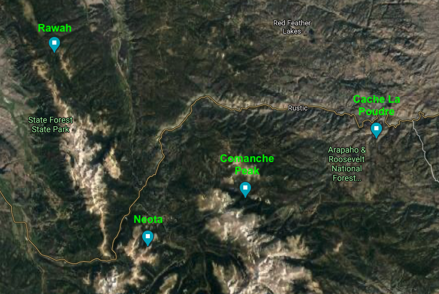

# W207 Final Project

## Forest Cover Type Prediction 

**Berkeley MIDS Program**

Team:  Blair Witch Project

Sharon Wu, Kevin Ngo, Vish Pillai, Blair Jones

Date:  11 April 2021

## Contents

| Folder | Description |
| --- | --- |
| 0_experiments | Individual team folders for EDA and model development. |
| 2021_03_09 | Initial draft of report.  |
| 2021_04_11_Final | Final version of report and team notebook. |

#### Final Report Presentation

<a href='https://docs.google.com/presentation/d/1klo51vk3mqWeEWL_n4Mk5A6Ugdcz_W--Bsz37IYno78/edit?usp=sharing'>
  
   Presentation
</a>

## Introduction

The challenge is to predict seven different forest cover types in four different wilderness areas of the Roosevelt National Forest of Northern Colorado with the best accuracy.  These areas represent forests with minimal human-caused disturbances, so that existing forest cover types are more a result of ecological processes rather than forest management practices.

Each 30 x 30 square meter section of land is described by 54 attributes (ex. elevation, area, soil type, distance to water, aspect, etc.).

The 4 wilderness areas:
- Rawah Wilderness Area
- Neota Wilderness Area
- Comanche Peak Wilderness Area
- Cache la Poudre Wilderness Area

The 7 forest cover types:
1. Spruce/Fir
2. Lodgepole Pine
3. Ponderosa Pine
4. Cottonwood/Willow
5. Aspen
6. Douglas-fir
7. Krummholz

## Data

- Elevation - Elevation in meters
- Aspect - Aspect in degrees azimuth
- Slope - Slope in degrees
- Horizontal_Distance_To_Hydrology - Horz Dist to nearest surface water features
- Vertical_Distance_To_Hydrology - Vert Dist to nearest surface water features
- Horizontal_Distance_To_Roadways - Horz Dist to nearest roadway
- Hillshade_9am (0 to 255 index) - Hillshade index at 9am, summer solstice
- Hillshade_Noon (0 to 255 index) - Hillshade index at noon, summer solstice
- Hillshade_3pm (0 to 255 index) - Hillshade index at 3pm, summer solstice
- Horizontal_Distance_To_Fire_Points - Horz Dist to nearest wildfire ignition points
- Wilderness_Area (4 binary columns, 0 = absence or 1 = presence) - Wilderness area designation
- Soil_Type (40 binary columns, 0 = absence or 1 = presence) - Soil Type designation
- Cover_Type (7 types, integers 1 to 7) - Forest Cover Type designation
    
## Summary

After thorough EDA, we decided to apply several transformations to the data to highlight key differences between the cover types across the explanatory variables.

With the transformed data, we analyzed the characteristics of several different machine learning models for this type of classification problem.

After some iterations to tune the features and hyperparameter, we conducted a final comparison, shown below.  The **ExtraTrees Classifier** achieved the best performance in terms of accuracy and execution time.

We also experimented with a hybrid model, using the Voting Classifier, which takes the output from 2 or more models and determines the best prediction for each sample from across the input models.  The Voting Classifier with 8 ExtraTrees models increased the accuracy by 0.2%, but took 9 times longer to train and predict.

The full analysis is described in the final report notebook and presentation.

| Model | Accuracy | Time | Comments |
| --- | --- | --- | --- |
| KNN | 0.811 | - | k=1 |
| Decision Tree | 0.771 | - | trees=19 |
| Random Forest | 0.868 | 12 sec | - |
| ***ExtraTrees*** | 0.911 | ***5 sec*** | random_state=1189 |
| **ExtraTrees Voting** | **0.913** | 45 sec | trees=100, random_state=[1189,883,2153,5568,2077,769,2223,2675] |
| XGBoost | 0.865 | 193 sec | - |
| LightGBM | 0.897 | 72 sec | boosting_type='gbdt', trees=200 |
| CatBoost | 0.876 | 96 sec | - |
| Neural Network | 0.865 | 192 sec | layers=6 |
